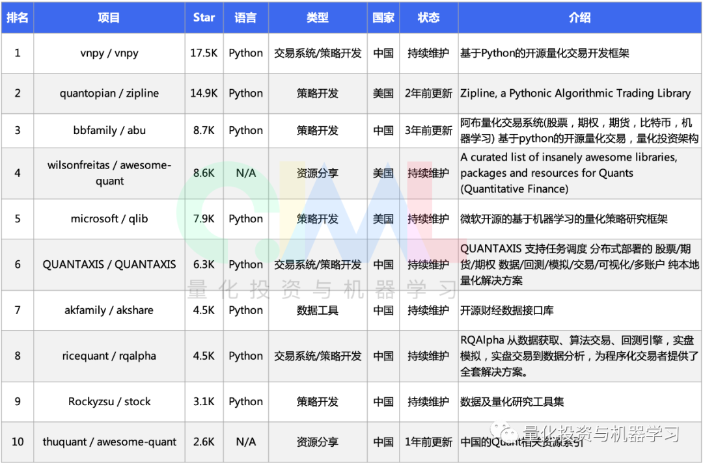
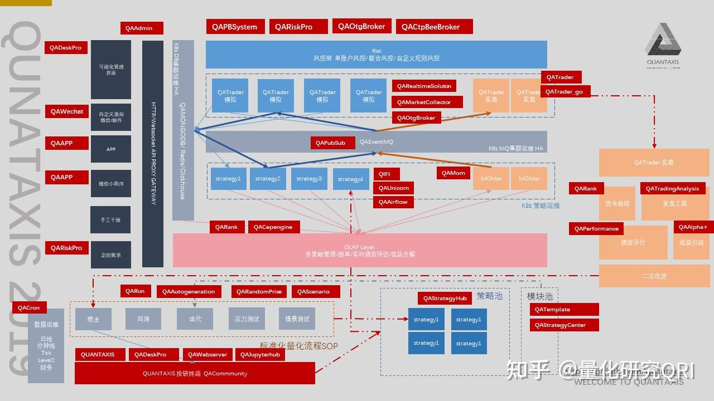
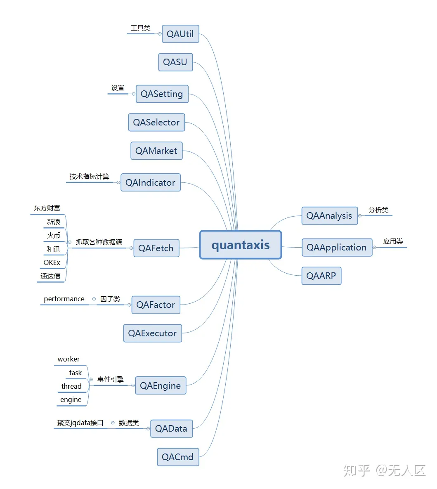

# env (check email for personal auth token)
git submodule update --init --remote
git config --global user.name "CoCoMilkyWay"
git config --global user.email "wangchuyin980321@gmail.com"
git config --global http.proxy http://198.18.0.1:7890
git config --global https.proxy https://198.18.0.1:7890
conda config --set proxy_servers.http http://198.18.0.1:7890
conda config --set proxy_servers.https https://198.18.0.1:7890
conda config --set ssl_verify false

~/.bashrc
export clash_ip="198.18.0.1"
export http_proxy="http://$clash_ip:7890"
export https_proxy="https://$clash_ip:7890"
export ftp_proxy="http://$clash_ip:7890"
export httpProxy="http://$clash_ip:7890"
export httpsProxy="https://$clash_ip:7890"
export ftpProxy="http://$clash_ip:7890"
export HTTP_PROXY="http://$clash_ip:7890"
export HTTPS_PROXY="https://$clash_ip:7890"

# use WSL IP(dynamic, use ipconfig to check in windows cmd) as display port to external VCXSRV server
export DISPLAY="178.28.240.1:0"
cd /home/chuyin/work/trade
code .

/etc/apt/apt.conf
Acquire::http::proxy "http://198.18.0.1:7890";
Acquire::https::proxy "https://198.18.0.1:7890";
Acquire::ftp::proxy "http://198.18.0.1:7890";

conda config --show
conda config --remove-key proxy_servers
conda clean --all

- pip freeze > requirements.txt
- cat requirements.txt | xargs -n 1 mamba install
- sed 's/==.*//' env/requirements.txt > env/requirements_nameonly.txt
- export QUANDL_API_KEY="9Q5bVWxqJE-94HKpntUg" ("6y7b4GG74vHE4sssJ8Ef")

# primarily use conda/mamba packages
# recommend not to use mamba/conda packages with pip packages
# create old environment for specific packages
# install left-over pip package in conda/mamba environment(not avaliable in system python(pip) env)
mamba update --all
mamba env list
mamba deactivate py_3p6
mamba env remove -n py_3p6
conda remove --name py_3p6 --all

# successful flow installing zipline+alphalens+pyfolio
# c-libraries / apt system packages
sudo apt install libatlas-base-dev python-dev-is-python3 gfortran pkg-config libfreetype6-dev hdf5-tools
# ta-lib
wget http://prdownloads.sourceforge.net/ta-lib/ta-lib-0.4.0-src.tar.gz
tar -xzf ta-lib-0.4.0-src.tar.gz
cd ta-lib/
sudo ./configure
sudo make
sudo make install

mamba create -n py_3p6 python=3.6 ipykernel
mamba env list
mamba activate py_3p6
mamba install numpy pandas seaborn pandas-datareader nbconvert mkl-service
mamba search PKG --info
mamba install -v --file req.txt
pip install zipline
mamba uninstall alembic
pip install alembic
pip install iso3166==2.0.2
zipline ingest -b quandl
mamba install alphalens pyfolio PyPortfolioOpt

sudo apt-get install sqlitebrowser

from importlib import metadata as importlib_metadata =>
import importlib_metadata

in pyfolio's rolling_fama_french function(line 550) in timeseries.py
~/mambaforge/envs/py_3p6/lib/python3.6/site-packages/pyfolio/timeseries.py
change to this so that A, B has same dimensions:
    A = factor_returns[beg:end]
    B = returns[beg:end]
    idx = A.index.intersection(B.index)
    A = A.loc[idx]
    B = B.loc[idx]

# to show pip/mamba install paths (use pip to install packages not avaliable in mamba)
pip list -v
mamba list -v

mamba create -n py_3p10 python=3.10 ipykernel
mamba install numpy pandas seaborn pandas-datareader nbconvert zipline-reloaded alphalens-reloaded pyfolio-reloaded
mamba upgrade&update --all

# trade
- https://bigquant.com/trading/list
- https://www.kaggle.com/competitions/ubiquant-market-prediction/leaderboard
- https://www.kaggle.com/competitions/g-research-crypto-forecasting/leaderboardv
- https://www.kaggle.com/competitions/optiver-realized-volatility-prediction/leaderboard

# textbook
    beginner:
        systematic trading -robert carver ***
        trading systems and methods -perry kaufman *
        advances in financial machine learning -marcos lopez ***
    risk managements:
        the leverage space trading model **
        mathematics of money management -ralph vince
    indicators:
        rocket science for trades -john ehlers
        cybernetic analysis for stocks and futures -john ehlers
        cycle analytics for traders -john ehlers ***
        statistically sound indicators for financial market prediction -timothy masters **
    stratergies:
        the universal tatics of successful trend trading -brent penfold
        stock on the move -andrew clenow
        cybernetic trading strategies -murray ruggireo
    system dev:
        testing and tuning market trading algorithms -timothy masters **
        permutation and randomization tests for trading system developments -timothy masters **
    misc:
        numerical recipes -william press
        assessing and improving prediction and classification -timothy masters
        data-driven science and engineering -steve brunton
    niche:
        technical analysis for algorithm pattern recognition -prodromos
        detecting regime change in computational finance -jun chen
        trading on sentiment -richard peterson

# misc
https://cloud.tencent.com/developer/article/1457661
https://github.com/jiangtiantu/factorhub
https://qsdoc.readthedocs.io/zh-cn/latest/index.html
https://www.windquant.com/qntcloud

因子库 WindDB 需要 Wind 金融工程数据库
因子库 WindDB2 需要 Wind 量化研究数据库
因子库 ArcticDB 需要 MongoDB 数据库
因子库 SQLDB 需要 Oracle, SQL Server 或者 MySQL 数据库中的一个
投资组合构造器 MatlabPC 需要 MATLAB, MATLAB Engine for Python 以及 yamlip(参见: “https://yalmip.github.io”)
投资组合构造器 CVXPC 需要 cvxpy(参见: “https://www.cvxpy.org”)

一般用作多因子选股模型的因子可以分为两大类：技术分析类因子和基本面分析类（主要基于财报数据）因子。

技术类因子主要有行情数据加工而来，又可分为趋势动量类、反转类及波动类等因子；
基本面类因子主要有盈利、成长、估值、收益、资本结构及宏观等；
大概总结如下：

财务类因子包括估值因子、规模因子、成长因子、质量因子和杠杆因子；

行情类因子包括技术因子、动量因子、风险因子、流动性因子；

预期类因子包括盈利预测因子；

因子提取方式：使用 API 在“量化因子”栏提取。

一级指标	二级指标	含义
财务类因子	估值因子	主要包括净利润市值比（市盈率倒数）、现金流市值比（市现率倒数）、净资产市值比（市净率倒数）、股息率等指标，用于反映公司盈利、投资回收、分红收益等方面的能力。
财务类因子	规模因子	规模因子从总市值、流通市值、总资产三个方面来衡量大盘规模、流通规模和公司资产规模。
财务类因子	成长因子	是指过去一段时间内股票的各项估值指标或收益指标的增长性因子。
财务类因子	质量因子/盈利能力因子	用于衡量公司整体盈利能力和营运能力的因子，如净资产收益率、资产回报率。
财务类因子	杠杆因子	用于衡量公司整体运行的负债与权益的配比情况的因子，常用于表示公司的债务压力和偿债能力，如资产负债率、流动比率、速动比率。
行情类因子	技术因子	技术因子是由技术指标构造的因子。
行情类因子	动量因子	动量因子是指过去一段时间内股票动量和反转的效应强弱的因子。
行情类因子	风险因子	风险因子主要是利用波动率、方差、标准差等风险衡量指标衡量了公司在收益、损失、成交量等方面的波动情况，值越大，说明风险越大。
行情类因子	流动性因子	流动性因子是指过去一段时间内股票的的换手率等指标。通过改变所取的时间区间的长度，可以观察到不同时长下的股票流动性对股价影响的效应强弱。
预期类因子	盈利预测因子	盈利预测因子是在不同时间段上对净利润、收益、营业收入及其变化率的一致预测，体现了市场预期。
其他	...	...